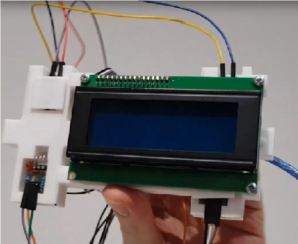

# Arduino based Chronograph
I used a microcontroller to read the signals of 2 laser receivers, 100mm apart and calculated time between.

# Watch youtube testing here
https://www.youtube.com/watch?v=Dmx6fU2c43Q&t=702s
